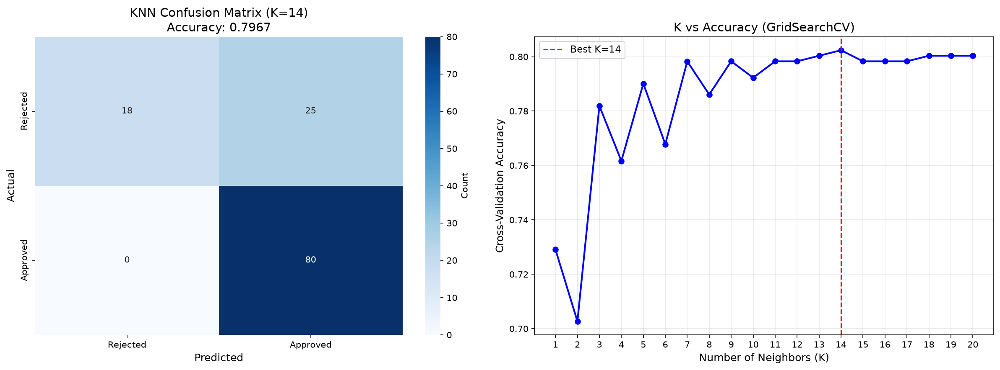

# 🏦 Loan Approval Prediction - Full-Stack Machine Learning Web App

An end-to-end Machine Learning web application that predicts whether a loan application will be **Approved** or **Rejected** based on applicant profile characteristics. Built with a **K-Nearest Neighbors (KNN)** model, a **FastAPI** REST backend, and a modern, animated multi-page **Next.js** frontend.



---

## 🌟 Key Features

- **Machine Learning Pipeline**:
  - Trained on 614 loan applications with 11 demographic and financial features.
  - Imputes missing numerical values with median and categorical values with mode.
  - Standardized with `StandardScaler` and encoded with `LabelEncoder`.
  - Hyperparameter-tuned with **GridSearchCV** (optimal $K=14$, **80.24%** CV accuracy).
  - **79.67%** test set accuracy with **100% precision on rejections** and **100% recall on approvals**.
- **FastAPI Backend**:
  - High-performance asynchronous REST API serving real-time predictions.
  - Automated feature validation with Pydantic.
  - Returns classification (`Approved` / `Rejected`) and model confidence score.
- **Next.js Multi-Page Frontend**:
  - **Landing Page (`/`)**: Hero section, dynamic illustrations, features, and model statistics.
  - **Prediction Form (`/predict`)**: Input sections for personal, financial, and credit information with animated result cards and confidence bars.
  - **Dashboard (`/dashboard`)**: Interactive animated $K$ vs. Accuracy bar charts, hoverable Confusion Matrix, and full classification report.
  - **History (`/history`)**: Local persistence of past predictions with expandable parameter views.
  - **About (`/about`)**: Methodology stepper, educational KNN diagram, and dataset distribution.
  - **Fluid Animations**: Page transitions, tab sliders, and chart loading effects powered by `framer-motion`.

---

## 📁 Repository Structure

```
├── train_u6lujuX_CVtuZ9i.csv       # Original dataset (614 records)
├── ml_pipeline/                     # Machine learning pipeline
│   ├── train_knn.py                 # Training script & GridSearchCV tuning
│   ├── knn_model.joblib             # Trained KNN model (K=14)
│   ├── scaler.joblib                # Fitted StandardScaler
│   ├── label_encoders.joblib        # Fitted LabelEncoders dictionary
│   ├── model_info.json              # Model parameters and metadata
│   ├── confusion_matrix.png         # Model visualization plot
│   └── requirements.txt             # ML dependencies
├── backend/                         # FastAPI REST API
│   ├── main.py                      # REST endpoints (/predict, /health)
│   └── requirements.txt             # Backend dependencies
└── frontend/                        # Next.js 16 + Tailwind CSS v4 frontend
    ├── src/
    │   ├── app/
    │   │   ├── page.tsx             # Landing page
    │   │   ├── predict/page.tsx     # Eligibility form & real-time result
    │   │   ├── dashboard/page.tsx   # Animated metrics & charts
    │   │   ├── history/page.tsx     # Prediction history with local storage
    │   │   ├── about/page.tsx       # Methodology & tech stack
    │   │   ├── template.tsx         # Page transition wrapper
    │   │   └── layout.tsx           # Global layout with Navbar & Footer
    │   └── components/
    │       ├── Navbar.tsx           # Navigation bar with sliding tab pill
    │       └── Footer.tsx           # Footer with links & tech summary
    └── package.json
```

---

## 📊 Model Evaluation Summary

| Metric | Score |
| :--- | :--- |
| **Optimal Parameter ($K$)** | **14** (GridSearchCV across $1 \le K \le 20$) |
| **Cross-Validation Accuracy** | **80.24%** (5-Fold Stratified CV) |
| **Test Accuracy** | **79.67%** (123 holdout samples) |
| **Precision (Rejected)** | **1.00** (Zero false rejections) |
| **Recall (Approved)** | **1.00** (Zero missed approvals) |

---

## 🚀 Quick Start Guide

### 1. Prerequisites
- **Python 3.10+**
- **Node.js 18+** & **npm**

---

### 2. Backend Setup & Run

1. Navigate to the backend directory:
   ```bash
   cd backend
   ```
2. Install Python dependencies:
   ```bash
   pip install -r requirements.txt
   ```
3. Start the FastAPI server:
   ```bash
   uvicorn main:app --reload
   ```
   *The API will start at [http://localhost:8000](http://localhost:8000). Interactive Swagger docs are available at [http://localhost:8000/docs](http://localhost:8000/docs).*

---

### 3. Frontend Setup & Run

1. Open a new terminal and navigate to the frontend directory:
   ```bash
   cd frontend
   ```
2. Install Node dependencies:
   ```bash
   npm install
   ```
3. Start the Next.js development server:
   ```bash
   npm run dev
   ```
4. Open [http://localhost:3000](http://localhost:3000) in your browser.

---

### 4. Re-training the Model (Optional)

To execute the data cleaning, feature scaling, GridSearch tuning, and artifact generation from scratch:
```bash
python ml_pipeline/train_knn.py
```

---

## 🛠️ Technology Stack

- **Machine Learning**: `scikit-learn`, `pandas`, `numpy`, `matplotlib`, `seaborn`, `joblib`
- **Backend API**: `FastAPI`, `Uvicorn`, `Pydantic`
- **Frontend App**: `Next.js 16` (App Router), `React 19`, `TypeScript`
- **Styling & Animation**: `Tailwind CSS v4`, `Framer Motion`, `Lucide React`

---

## 📜 License
This project is open-source and available under the [MIT License](LICENSE).
